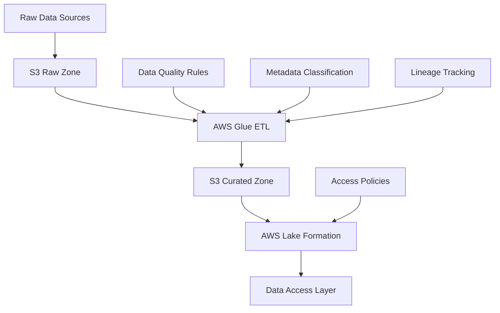

# AWS Data Governance Framework

A modular, industry-agnostic data governance framework built on AWS-native services. This framework provides a flexible foundation for implementing data governance across various industries while maintaining compliance, data quality, and security.

## Architecture



## Key Components

### 1. Data Classification & Privacy
- Automated PII detection and classification
- Industry-specific data tagging
- Privacy level enforcement

### 2. Access Control
- Role-based access control (RBAC)
- Column and row-level security
- Data masking and encryption

### 3. Data Quality
- Automated quality checks
- Data validation rules
- Quality metrics tracking

### 4. Lineage & Metadata
- End-to-end data lineage tracking
- Metadata management
- Change history

## Getting Started

### Prerequisites
- AWS Account with appropriate permissions
- Python 3.8+
- AWS CLI configured
- Terraform or AWS CDK installed

### Installation

1. Clone this repository
2. Install dependencies:
```bash
pip install -r requirements.txt
```

3. Configure your AWS credentials:
```bash
aws configure
```

4. Deploy the infrastructure:
```bash
cd infra
terraform init
terraform apply
```

## Industry-Specific Implementations

### Higher Education Example
The framework includes a complete Higher Education implementation example that demonstrates:
- Student record privacy controls
- GPA masking for sensitive data
- Role-based access for faculty and administration
- Data quality rules for academic records

### Configuration
Each industry implementation is driven by YAML configuration files in the `/configs` directory. To implement for a new industry:
1. Create a new config file in `/configs`
2. Define industry-specific rules and policies
3. Deploy using the provided scripts

## Directory Structure

```
├── framework/
│   ├── metadata_classification.py
│   ├── quality_rules.py
│   ├── access_policies.yaml
│   └── lineage_tracking_stub.py
├── examples/
│   └── higher_ed/
│       ├── student_records_sample.csv
│       ├── gpa_masking_policy.yaml
│       └── role_matrix.json
├── scripts/
│   ├── deploy_lake_formation_policies.py
│   └── glue_job_sample.py
├── configs/
│   ├── higher_ed_config.yaml
│   ├── finance_config.yaml
│   └── healthcare_config.yaml
└── infra/
    └── [Terraform/CDK files]
```

## Contributing

1. Fork the repository
2. Create a feature branch
3. Submit a pull request

## License

MIT License - See LICENSE file for details 