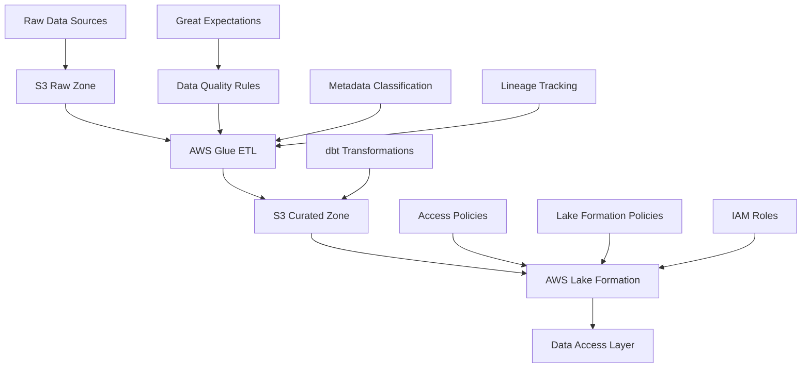

# AWS Data Governance Framework

A modular, industry-agnostic data governance framework built on AWS-native services. This framework provides a flexible foundation for implementing data governance across various industries while maintaining compliance, data quality, and security.


## Architecture



## Key Components

### 1. Data Classification & Privacy
- Automated PII detection and classification
- Industry-specific data tagging
- Privacy level enforcement

### 2. Access Control
- Role-based access control (RBAC)
- Column and row-level security
- Data masking and encryption

### 3. Data Quality
- Automated quality checks
- Data validation rules
- Quality metrics tracking

### 4. Lineage & Metadata
- End-to-end data lineage tracking
- Metadata management
- Change history

## Deployment Steps

### 1. Prerequisites
- AWS Account with appropriate permissions
- Python 3.8+
- AWS CLI configured
- Terraform installed
- Git installed
- dbt installed
- Great Expectations installed

### 2. Clone the Repository
```bash
git clone https://github.com/dilliraja/data-governance-framework.git
cd data-governance-framework
```

### 3. Set Up Python Environment
```bash
# Create and activate virtual environment
python -m venv venv
source venv/bin/activate  # On Windows: venv\Scripts\activate

# Install dependencies
pip install -r requirements.txt
```

### 4. Configure AWS Credentials
```bash
aws configure
# Enter your AWS Access Key ID
# Enter your AWS Secret Access Key
# Enter your default region
# Enter your output format (json)
```

### 5. Deploy Infrastructure
```bash
# Navigate to infrastructure directory
cd infra

# Initialize Terraform
terraform init

# Review the planned changes
terraform plan

# Apply the infrastructure
terraform apply

# Note down the outputs for later use
terraform output
```

### 6. Configure Industry-Specific Settings
```bash
# Copy the Higher Education example configuration
cp configs/higher_ed_config.yaml configs/your_industry_config.yaml

# Edit the configuration file with your industry-specific rules
# - Update classification rules
# - Modify quality rules
# - Adjust access control policies
# - Configure masking rules
```

### 7. Deploy Lake Formation Policies
```bash
# Deploy access policies
python scripts/deploy_lake_formation_policies.py --config configs/your_industry_config.yaml
```

### 8. Set Up Data Pipeline
```bash
# Upload sample data to S3
aws s3 cp examples/higher_ed/student_records_sample.csv s3://<data-lake-bucket>/raw/student_records/

# Create and start Glue crawler
aws glue start-crawler --name data-governance-student-records-crawler

# Deploy Glue ETL job
aws glue create-job --name data-governance-etl --role <data-steward-role-arn> --command "Name=glueetl,ScriptLocation=s3://<bucket>/scripts/glue_job_sample.py"

# Start the ETL job
aws glue start-job-run --job-name data-governance-etl
```

### 9. Set Up dbt Project
```bash
# Navigate to dbt project directory
cd framework/dbt_project

# Install dbt dependencies
dbt deps

# Run dbt models
dbt run

# Run tests
dbt test

# Generate documentation
dbt docs generate
dbt docs serve
```

### 10. Verify Deployment
```bash
# Check S3 buckets
aws s3 ls s3://<data-lake-bucket>/

# Verify Glue database and tables
aws glue get-database --name higher_ed_data
aws glue get-tables --database-name higher_ed_data

# Check Lake Formation permissions
aws lakeformation list-permissions --resource-type DATABASE

# Verify dbt models
dbt test
```

### 11. Monitor and Maintain
```bash
# View CloudWatch logs
aws logs get-log-events --log-group-name /data-governance/access-logs

# Check CloudWatch alarms
aws cloudwatch describe-alarms --alarm-name-prefix data-governance

# Monitor dbt runs
dbt run --profiles-dir . --target prod
```

## Directory Structure

```
├── framework/
│   ├── metadata_classification.py
│   ├── quality_rules.py
│   ├── access_policies.yaml
│   ├── lineage_tracking_stub.py
│   └── dbt_project/
│       ├── models/
│       │   ├── staging/
│       │   ├── intermediate/
│       │   └── marts/
│       ├── dbt_project.yml
│       └── profiles.yml
├── examples/
│   └── higher_ed/
│       ├── student_records_sample.csv
│       ├── gpa_masking_policy.yaml
│       └── role_matrix.json
├── scripts/
│   ├── deploy_lake_formation_policies.py
│   └── glue_job_sample.py
├── configs/
│   ├── higher_ed_config.yaml
│   ├── finance_config.yaml
│   └── healthcare_config.yaml
└── infra/
    └── [Terraform/CDK files]
```

## Author
**Dilliraja Sundar**

## Acknowledgments

- AWS Lake Formation
- AWS Glue
- dbt Labs
- Great Expectations