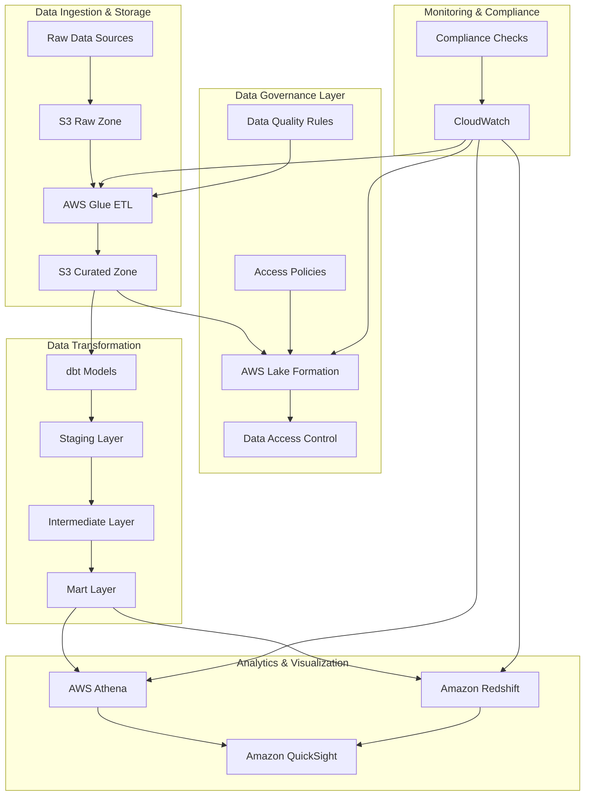
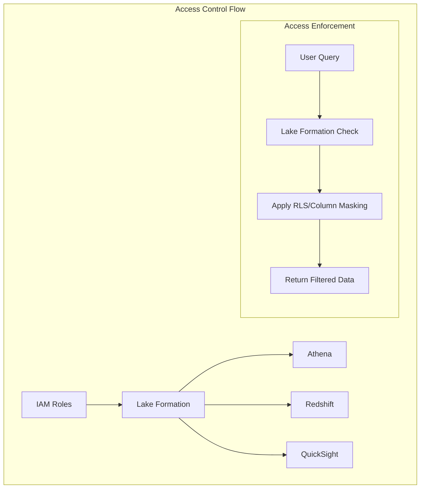

# Data Governance Framework

A modular, industry-agnostic data governance framework built on AWS-native services. This framework provides a flexible foundation for implementing data governance across various industries while maintaining compliance, data quality, and security.


## Architecture



## Access Control Architecture



## Key Components

### 1. Data Classification & Privacy
- Automated PII detection and classification
- Industry-specific data tagging
- Privacy level enforcement
- Data sensitivity levels (Public, Internal, Confidential, Restricted)

### 2. Access Control
- Role-based access control (RBAC)
- Column and row-level security
- Data masking and encryption
- Fine-grained access control through Lake Formation
- Cross-service permission management

### 3. Data Quality
- Automated quality checks using Great Expectations
- Data validation rules
- Quality metrics tracking
- Automated data profiling
- Data quality dashboards

### 4. Lineage & Metadata
- End-to-end data lineage tracking
- Metadata management
- Change history
- Impact analysis
- Data catalog integration

### 5. Analytics & Visualization
- AWS Athena for interactive SQL queries
- Amazon Redshift for data warehousing
- Amazon QuickSight for business intelligence
- Real-time analytics and reporting
- Custom dashboards and visualizations

### 6. Governance Controls by Service

#### AWS Athena Governance
- **Query Access Control**
  - IAM policies for query execution
  - Workgroup-based access restrictions
  - Query result encryption
  - Query history monitoring
  - Cost controls per workgroup

- **Data Access Policies**
  - Lake Formation integration for fine-grained access
  - Column-level security
  - Row-level filtering
  - Query result encryption
  - Audit logging of all queries

#### Amazon Redshift Governance
- **Data Access Control**
  - Role-based access control (RBAC)
  - Column-level security
  - Row-level security (RLS)
  - Dynamic data masking
  - Data sharing controls

- **Security Features**
  - Encryption at rest and in transit
  - Network isolation (VPC)
  - Audit logging
  - Automated backups
  - Cross-region replication

- **Compliance Controls**
  - Data retention policies
  - Access logging
  - Compliance reporting
  - Automated policy enforcement

#### Amazon QuickSight Governance
- **User Access Management**
  - IAM integration for user authentication
  - Role-based permissions
  - Dashboard sharing controls
  - Row-level security integration

- **Data Source Controls**
  - Secure data source connections
  - Credential management
  - Data refresh policies
  - Source access logging

- **Content Security**
  - Dashboard encryption
  - Export controls
  - Print restrictions
  - Watermarking options

### 7. Cross-Service Governance Integration
- **Unified Access Control**
  - Single sign-on (SSO) integration
  - Consistent permission model
  - Centralized user management
  - Cross-service audit logging

- **Data Lineage Tracking**
  - End-to-end data flow monitoring
  - Impact analysis
  - Change tracking
  - Compliance reporting

- **Compliance Monitoring**
  - Automated policy checks
  - Real-time alerts
  - Compliance dashboards
  - Audit trail generation

## Access Control Implementation

### 1. Lake Formation Setup
```yaml
# Example access policy
permissions:
  - role: data_analyst
    access_level: read
    tables:
      - name: student_records
        columns:
          - student_id
          - course_id
          - grade
        row_filter: "department = 'Computer Science'"
```

### 2. IAM Role Configuration
```json
{
  "role_name": "data_analyst",
  "permissions": [
    "lakeformation:GetDataAccess",
    "athena:StartQueryExecution",
    "quicksight:DescribeDashboard"
  ]
}
```

### 3. Row-Level Security
```sql
-- Example RLS policy
CREATE POLICY student_records_policy ON student_records
    FOR SELECT
    USING (department = current_user_department());
```

## Deployment Steps

### 1. Prerequisites
- AWS Account with appropriate permissions
- Python 3.8+
- AWS CLI configured
- Terraform installed
- Git installed
- dbt installed
- Great Expectations installed

### 2. Clone the Repository
```bash
git clone https://github.com/dilliraja/data-governance-framework.git
cd data-governance-framework
```

### 3. Set Up Python Environment
```bash
# Create and activate virtual environment
python -m venv venv
source venv/bin/activate  # On Windows: venv\Scripts\activate

# Install dependencies
pip install -r requirements.txt
```

### 4. Configure AWS Credentials
```bash
aws configure
# Enter your AWS Access Key ID
# Enter your AWS Secret Access Key
# Enter your default region
# Enter your output format (json)
```

### 5. Deploy Infrastructure
```bash
# Navigate to infrastructure directory
cd infra

# Initialize Terraform
terraform init

# Review the planned changes
terraform plan

# Apply the infrastructure
terraform apply

# Note down the outputs for later use
terraform output
```

### 6. Configure Industry-Specific Settings
```bash
# Copy the Higher Education example configuration
cp configs/higher_ed_config.yaml configs/your_industry_config.yaml

# Edit the configuration file with your industry-specific rules
# - Update classification rules
# - Modify quality rules
# - Adjust access control policies
# - Configure masking rules
```

### 7. Deploy Lake Formation Policies
```bash
# Deploy access policies
python scripts/deploy_lake_formation_policies.py --config configs/your_industry_config.yaml
```

### 8. Set Up Data Pipeline
```bash
# Upload sample data to S3
aws s3 cp examples/higher_ed/student_records_sample.csv s3://<data-lake-bucket>/raw/student_records/

# Create and start Glue crawler
aws glue start-crawler --name data-governance-student-records-crawler

# Deploy Glue ETL job
aws glue create-job --name data-governance-etl --role <data-steward-role-arn> --command "Name=glueetl,ScriptLocation=s3://<bucket>/scripts/glue_job_sample.py"

# Start the ETL job
aws glue start-job-run --job-name data-governance-etl
```

### 9. Set Up dbt Project
```bash
# Navigate to dbt project directory
cd framework/dbt_project

# Install dbt dependencies
dbt deps

# Run dbt models
dbt run

# Run tests
dbt test
```

## Project Structure
```
data-governance-framework/
├── configs/                    # Configuration files
│   ├── higher_ed_config.yaml   # Higher education specific config
│   └── access_policies.yaml    # Access control policies
├── infra/                      # Infrastructure as Code
│   ├── main.tf                # Main Terraform configuration
│   ├── variables.tf           # Terraform variables
│   └── modules/               # Terraform modules
├── framework/                  # Core framework code
│   ├── dbt_project/          # dbt models and transformations
│   ├── great_expectations/   # Data quality checks
│   └── scripts/              # Utility scripts
├── examples/                  # Example implementations
│   └── higher_ed/            # Higher education example
├── tests/                    # Test cases
├── docs/                     # Documentation
└── [Terraform/CDK files]     # Infrastructure definitions
```

## Author
**Dilliraja Sundar**

## Acknowledgments

- AWS Lake Formation
- AWS Glue
- dbt Labs
- Great Expectations