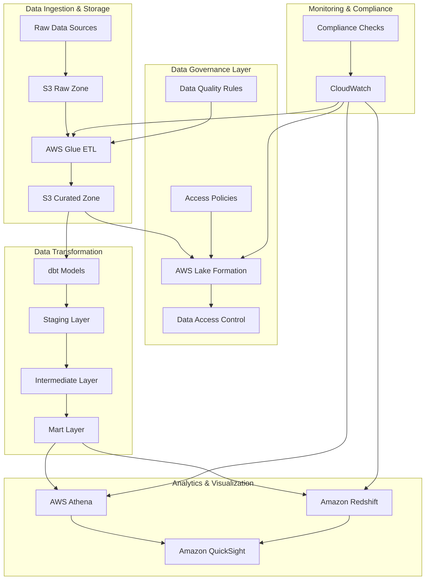

# Data Governance Framework

A modular, industry-agnostic data governance framework built on AWS-native services. This framework provides a flexible foundation for implementing data governance across various industries while maintaining compliance, data quality, and security.


## Architecture



## Key Components

### 1. Data Classification & Privacy
- Automated PII detection and classification
- Industry-specific data tagging
- Privacy level enforcement

### 2. Access Control
- Role-based access control (RBAC)
- Column and row-level security
- Data masking and encryption

### 3. Data Quality
- Automated quality checks
- Data validation rules
- Quality metrics tracking

### 4. Lineage & Metadata
- End-to-end data lineage tracking
- Metadata management
- Change history

### 5. Analytics & Visualization
- AWS Athena for interactive SQL queries
- Amazon Redshift for data warehousing
- Amazon QuickSight for business intelligence
- Real-time analytics and reporting
- Custom dashboards and visualizations

### 6. Governance Controls by Service

#### AWS Athena Governance
- **Query Access Control**
  - IAM policies for query execution
  - Workgroup-based access restrictions
  - Query result encryption
  - Query history monitoring
  - Cost controls per workgroup

- **Data Access Policies**
  - Lake Formation integration for fine-grained access
  - Column-level security
  - Row-level filtering
  - Query result encryption
  - Audit logging of all queries

#### Amazon Redshift Governance
- **Data Access Control**
  - Role-based access control (RBAC)
  - Column-level security
  - Row-level security (RLS)
  - Dynamic data masking
  - Data sharing controls

- **Security Features**
  - Encryption at rest and in transit
  - Network isolation (VPC)
  - Audit logging
  - Automated backups
  - Cross-region replication

- **Compliance Controls**
  - Data retention policies
  - Access logging
  - Compliance reporting
  - Automated policy enforcement

#### Amazon QuickSight Governance
- **User Access Management**
  - IAM integration for user authentication
  - Role-based permissions
  - Dashboard sharing controls
  - Row-level security integration

- **Data Source Controls**
  - Secure data source connections
  - Credential management
  - Data refresh policies
  - Source access logging

- **Content Security**
  - Dashboard encryption
  - Export controls
  - Print restrictions
  - Watermarking options

### 7. Cross-Service Governance Integration
- **Unified Access Control**
  - Single sign-on (SSO) integration
  - Consistent permission model
  - Centralized user management
  - Cross-service audit logging

- **Data Lineage Tracking**
  - End-to-end data flow monitoring
  - Impact analysis
  - Change tracking
  - Compliance reporting

- **Compliance Monitoring**
  - Automated policy checks
  - Real-time alerts
  - Compliance dashboards
  - Audit trail generation

## Deployment Steps

### 1. Prerequisites
- AWS Account with appropriate permissions
- Python 3.8+
- AWS CLI configured
- Terraform installed
- Git installed
- dbt installed
- Great Expectations installed

### 2. Clone the Repository
```bash
git clone https://github.com/dilliraja/data-governance-framework.git
cd data-governance-framework
```

### 3. Set Up Python Environment
```bash
# Create and activate virtual environment
python -m venv venv
source venv/bin/activate  # On Windows: venv\Scripts\activate

# Install dependencies
pip install -r requirements.txt
```

### 4. Configure AWS Credentials
```bash
aws configure
# Enter your AWS Access Key ID
# Enter your AWS Secret Access Key
# Enter your default region
# Enter your output format (json)
```

### 5. Deploy Infrastructure
```bash
# Navigate to infrastructure directory
cd infra

# Initialize Terraform
terraform init

# Review the planned changes
terraform plan

# Apply the infrastructure
terraform apply

# Note down the outputs for later use
terraform output
```

### 6. Configure Industry-Specific Settings
```bash
# Copy the Higher Education example configuration
cp configs/higher_ed_config.yaml configs/your_industry_config.yaml

# Edit the configuration file with your industry-specific rules
# - Update classification rules
# - Modify quality rules
# - Adjust access control policies
# - Configure masking rules
```

### 7. Deploy Lake Formation Policies
```bash
# Deploy access policies
python scripts/deploy_lake_formation_policies.py --config configs/your_industry_config.yaml
```

### 8. Set Up Data Pipeline
```bash
# Upload sample data to S3
aws s3 cp examples/higher_ed/student_records_sample.csv s3://<data-lake-bucket>/raw/student_records/

# Create and start Glue crawler
aws glue start-crawler --name data-governance-student-records-crawler

# Deploy Glue ETL job
aws glue create-job --name data-governance-etl --role <data-steward-role-arn> --command "Name=glueetl,ScriptLocation=s3://<bucket>/scripts/glue_job_sample.py"

# Start the ETL job
aws glue start-job-run --job-name data-governance-etl
```

### 9. Set Up dbt Project
```bash
# Navigate to dbt project directory
cd framework/dbt_project

# Install dbt dependencies
dbt deps

# Run dbt models
dbt run

# Run tests
dbt test

# Generate documentation
dbt docs generate
dbt docs serve
```

### 10. Verify Deployment
```bash
# Check S3 buckets
aws s3 ls s3://<data-lake-bucket>/

# Verify Glue database and tables
aws glue get-database --name higher_ed_data
aws glue get-tables --database-name higher_ed_data

# Check Lake Formation permissions
aws lakeformation list-permissions --resource-type DATABASE

# Verify dbt models
dbt test
```

### 11. Monitor and Maintain
```bash
# View CloudWatch logs
aws logs get-log-events --log-group-name /data-governance/access-logs

# Check CloudWatch alarms
aws cloudwatch describe-alarms --alarm-name-prefix data-governance

# Monitor dbt runs
dbt run --profiles-dir . --target prod
```

## Directory Structure

```
├── framework/
│   ├── metadata_classification.py
│   ├── quality_rules.py
│   ├── access_policies.yaml
│   ├── lineage_tracking_stub.py
│   └── dbt_project/
│       ├── models/
│       │   ├── staging/
│       │   ├── intermediate/
│       │   └── marts/
│       ├── dbt_project.yml
│       └── profiles.yml
├── examples/
│   └── higher_ed/
│       ├── student_records_sample.csv
│       ├── gpa_masking_policy.yaml
│       └── role_matrix.json
├── scripts/
│   ├── deploy_lake_formation_policies.py
│   └── glue_job_sample.py
├── configs/
│   ├── higher_ed_config.yaml
│   ├── finance_config.yaml
│   └── healthcare_config.yaml
└── infra/
    └── [Terraform/CDK files]
```

## Author
**Dilliraja Sundar**

## Acknowledgments

- AWS Lake Formation
- AWS Glue
- dbt Labs
- Great Expectations

## Code to Instruction Mapping

### 1. Infrastructure as Code (Terraform)
```
infra/
├── modules/
│   ├── data_lake/          # S3 buckets and data lake setup
│   ├── glue_catalog/       # Glue database and table definitions
│   ├── iam_roles/          # IAM roles and policies
│   └── lake_formation/     # Lake Formation permissions
```

**Implementation Steps:**
1. Deploy base infrastructure:
```bash
cd infra
terraform init
terraform apply
```

### 2. Data Quality Framework
```
framework/
├── quality_rules.py        # Data quality rules implementation
└── great_expectations/     # Great Expectations configurations
```

**Implementation Steps:**
1. Set up data quality rules:
```bash
python framework/quality_rules.py --config configs/your_industry_config.yaml
```

### 3. Data Transformation (dbt)
```
framework/dbt_project/
├── models/
│   ├── staging/           # Raw data models
│   ├── intermediate/      # Transformed data models
│   └── marts/            # Analytics-ready models
├── dbt_project.yml       # Project configuration
└── profiles.yml          # Connection profiles
```

**Implementation Steps:**
1. Configure dbt:
```bash
cd framework/dbt_project
dbt deps
dbt run
```

### 4. Access Control Implementation
```
framework/
├── access_policies.yaml   # Access control definitions
└── scripts/
    └── deploy_lake_formation_policies.py
```

**Implementation Steps:**
1. Deploy access policies:
```bash
python scripts/deploy_lake_formation_policies.py --config configs/your_industry_config.yaml
```

### 5. Analytics Layer Setup

#### AWS Athena
```yaml
# configs/athena_config.yaml
workgroups:
  - name: analytics
    encryption: SSE_S3
    query_results_location: s3://data-lake-bucket/athena-results/
    access_control:
      - role: DataAnalyst
        permissions: ["SELECT"]
```

**Implementation Steps:**
1. Create Athena workgroups:
```bash
aws athena create-work-group --name analytics --configuration file://configs/athena_config.yaml
```

#### Amazon Redshift
```yaml
# configs/redshift_config.yaml
cluster:
  node_type: ra3.xlplus
  number_of_nodes: 2
  encryption: true
  vpc_security_groups: ["sg-xxxxx"]
  iam_roles:
    - arn:aws:iam::account:role/RedshiftLoadRole
```

**Implementation Steps:**
1. Deploy Redshift cluster:
```bash
aws redshift create-cluster --cli-input-json file://configs/redshift_config.yaml
```

#### Amazon QuickSight
```yaml
# configs/quicksight_config.yaml
datasources:
  - name: student_analytics
    type: ATHENA
    connection:
      database: higher_ed_data
      workgroup: analytics
    permissions:
      - principal: DataAnalyst
        actions: ["read", "query"]
```

**Implementation Steps:**
1. Configure QuickSight:
```bash
aws quicksight create-data-source --cli-input-json file://configs/quicksight_config.yaml
```

### 6. Monitoring and Compliance
```
framework/
├── monitoring/
│   ├── cloudwatch_alarms.py
│   └── compliance_checks.py
└── scripts/
    └── generate_compliance_report.py
```

**Implementation Steps:**
1. Set up monitoring:
```bash
python framework/monitoring/cloudwatch_alarms.py
python framework/monitoring/compliance_checks.py
```

### 7. Testing and Validation
```
framework/
├── tests/
│   ├── test_data_quality.py
│   ├── test_access_control.py
│   └── test_compliance.py
└── scripts/
    └── run_validation.py
```

**Implementation Steps:**
1. Run tests:
```bash
python -m pytest framework/tests/
python framework/scripts/run_validation.py
```

## Directory Structure with Purpose

```
├── framework/                    # Core framework implementation
│   ├── metadata_classification.py    # Metadata tagging and classification
│   ├── quality_rules.py             # Data quality rules
│   ├── access_policies.yaml         # Access control definitions
│   ├── lineage_tracking_stub.py     # Data lineage implementation
│   └── dbt_project/                # Data transformation layer
│       ├── models/                 # dbt models
│       │   ├── staging/           # Raw data models
│       │   ├── intermediate/      # Transformed data models
│       │   └── marts/            # Analytics-ready models
│       ├── dbt_project.yml       # Project configuration
│       └── profiles.yml          # Connection profiles
├── examples/                     # Example implementations
│   └── higher_ed/               # Higher education example
│       ├── student_records_sample.csv
│       ├── gpa_masking_policy.yaml
│       └── role_matrix.json
├── scripts/                     # Deployment and utility scripts
│   ├── deploy_lake_formation_policies.py
│   └── glue_job_sample.py
├── configs/                     # Configuration files
│   ├── higher_ed_config.yaml    # Higher education configuration
│   ├── finance_config.yaml      # Finance industry configuration
│   └── healthcare_config.yaml   # Healthcare industry configuration
└── infra/                      # Infrastructure as Code
    └── [Terraform/CDK files]    # Infrastructure definitions
```