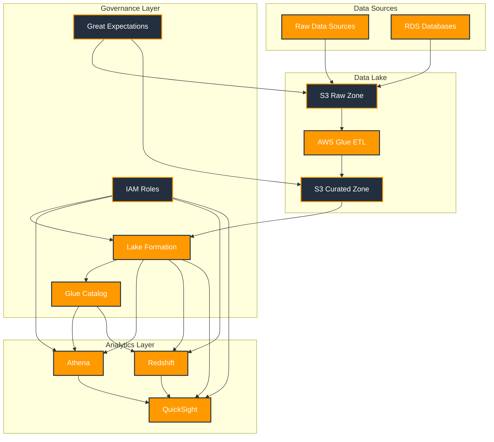

# Data Governance Framework

A modular, industry-agnostic data governance framework built on AWS-native services. This framework provides a flexible foundation for implementing data governance across various industries while maintaining compliance, data quality, and security.

## Architecture



## Key Components

### 1. Data Sources & Ingestion
- Raw data sources (CSV, JSON, etc.)
- RDS databases
- S3 Raw Zone for landing data
- AWS Glue ETL for data processing
- S3 Curated Zone for processed data

### 2. Governance Layer
- **Lake Formation**
  - Centralized access control
  - Row-level security
  - Column masking
  - Data permissions management

- **IAM Roles**
  - User authentication
  - Service access control
  - Permission management

- **Glue Catalog**
  - Metadata management
  - Data discovery
  - Schema management

- **Great Expectations**
  - Data quality validation
  - Automated testing
  - Quality monitoring

### 3. Analytics Layer
- **Athena**
  - Interactive SQL queries
  - Lake Formation integration
  - Query-level access control

- **Redshift**
  - Data warehousing
  - Table-level security
  - Column-level security

- **QuickSight**
  - Business intelligence
  - Dashboard access control
  - Row-level security integration

## Access Control Flow

### 1. Authentication & Authorization
1. User authenticates via IAM role
2. Lake Formation checks permissions
3. Access policies are applied
4. Data is filtered based on permissions

### 2. Data Protection
- Row-level security filters data
- Column masking protects sensitive information
- Encryption at rest and in transit
- Audit logging for compliance

### 3. Service Integration
- Consistent access control across services
- Unified permission model
- Centralized policy management
- Cross-service audit trails

## Project Structure
```
data-governance-framework/
├── configs/                    # Configuration files
│   ├── higher_ed_config.yaml   # Higher education specific config
│   └── access_policies.yaml    # Access control policies
├── infra/                      # Infrastructure as Code
│   ├── main.tf                # Main Terraform configuration
│   ├── variables.tf           # Terraform variables
│   └── modules/               # Terraform modules
├── framework/                  # Core framework code
│   ├── dbt_project/          # dbt models and transformations
│   ├── great_expectations/   # Data quality checks
│   └── scripts/              # Utility scripts
├── examples/                  # Example implementations
│   └── higher_ed/            # Higher education example
├── tests/                    # Test cases
├── docs/                     # Documentation
└── [Terraform/CDK files]     # Infrastructure definitions
```

## Author
**Dilliraja Sundar**

## Acknowledgments

- AWS Lake Formation
- AWS Glue
- dbt Labs
- Great Expectations