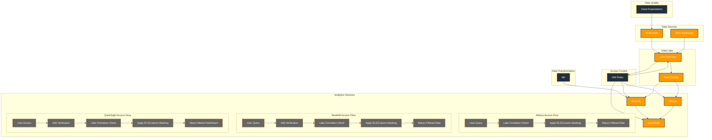

## Access Control Flow Explanation

### 1. Athena Access Control
1. User submits a query through Athena
2. Query is intercepted by Lake Formation
3. Lake Formation checks:
   - User's IAM role
   - Table/column permissions
   - Row-level security policies
   - Column masking rules
4. If authorized, query proceeds with applied restrictions
5. Results are returned to user with appropriate data masking

### 2. Redshift Access Control
1. User connects to Redshift
2. Authentication through IAM role
3. Lake Formation checks permissions
4. Row-level security policies are applied
5. Column masking is enforced
6. Filtered data is returned to user

### 3. QuickSight Access Control
1. User accesses QuickSight dashboard
2. IAM role is verified
3. Lake Formation permissions are checked
4. Row-level security and column masking are applied
5. User sees only authorized data in dashboard

## Key Components

### Lake Formation
- Central access control point
- Manages permissions for all data access
- Enforces row-level security
- Applies column masking
- Integrates with IAM roles

### IAM Roles
- Defines user permissions
- Maps to Lake Formation access levels
- Controls service access
- Manages authentication

### Row-Level Security
- Filters data based on user attributes
- Applied at query time
- Consistent across all services
- Managed through Lake Formation

### Column Masking
- Protects sensitive data
- Applied dynamically
- Consistent across services
- Configurable per column 