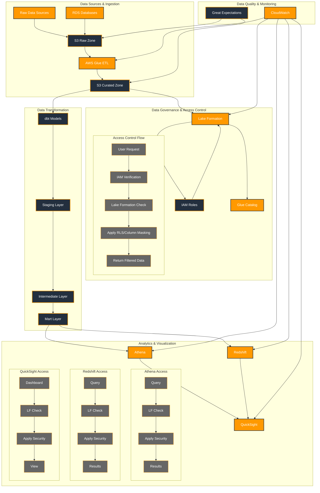

## Architecture Components

### 1. Data Sources & Ingestion
- Raw data sources (CSV, JSON, etc.)
- RDS databases
- S3 Raw Zone for landing data
- AWS Glue ETL for data processing
- S3 Curated Zone for processed data

### 2. Data Governance & Access Control
- Lake Formation for centralized access control
- IAM roles for authentication
- Glue Catalog for metadata management
- Access control flow:
  1. User request
  2. IAM verification
  3. Lake Formation permission check
  4. Apply row-level security/column masking
  5. Return filtered data

### 3. Data Transformation
- dbt models for data transformation
- Staging layer for raw data
- Intermediate layer for transformations
- Mart layer for analytics-ready data

### 4. Analytics & Visualization
- Athena for interactive SQL queries
- Redshift for data warehousing
- QuickSight for visualization
- Each service has its own access control flow

### 5. Data Quality & Monitoring
- Great Expectations for data quality
- CloudWatch for monitoring
- End-to-end observability

## Access Control Flow

### 1. User Authentication
- IAM roles define user permissions
- Lake Formation manages data access
- Consistent permission model across services

### 2. Data Access
- Row-level security filters data
- Column masking protects sensitive data
- Access policies are service-agnostic

### 3. Service-Specific Controls
- Athena: Query-level access control
- Redshift: Table and column-level security
- QuickSight: Dashboard and visualization access

### 4. Monitoring & Audit
- CloudWatch for real-time monitoring
- Access logs for audit trails
- Compliance reporting 
- Configurable per column 